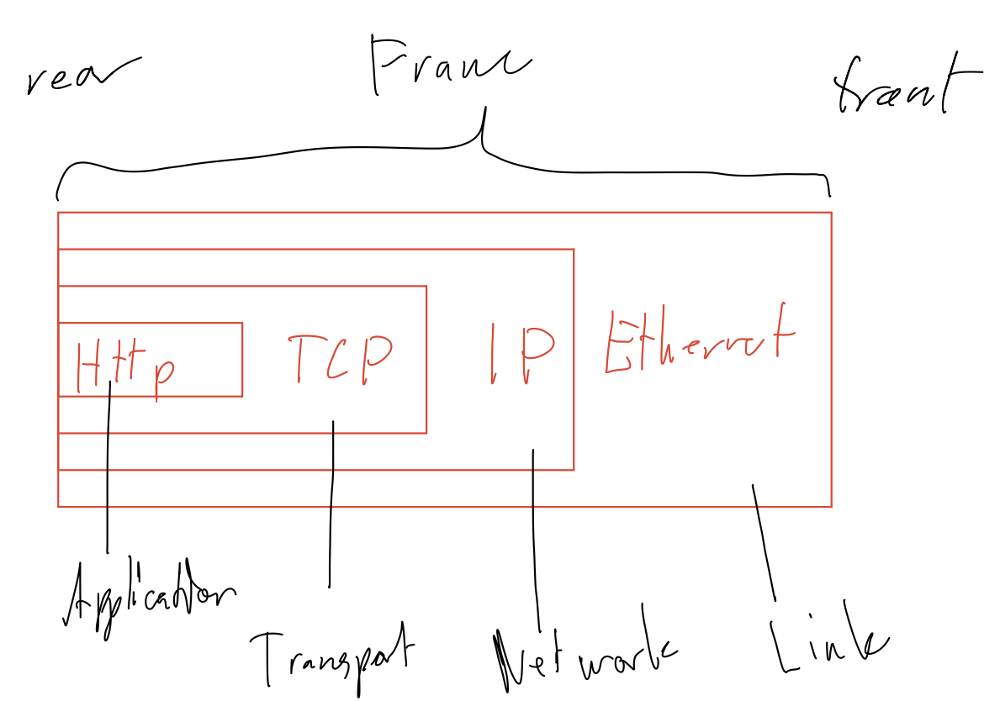

# 1.
### a. Which transport protocol is used for web traffic?
```bash
TCP = Transport control protocol
```
### b. In which IP header field can you get that information?
```bash
Internet protocol -> Protocol: TCP
And in the transport layer. The header is named "Transmission Control Protocol".
```
### c. Which value (number) identifies this transport protocol?
```bash
0x06
```
# 2.
### a. Which application protocol is used for web traffic?
```bash
Hypertext Transfer Protocol (HTTP/1.1)
```
### b. When your computer receives a TCP/IP packet, how does it decide to which application it should send the packet? E.g.to choose whether your web server or mail server should handle the packet?
```bash
Dst port contains the portnumber associated with the application. In our example port is 41188.
```
# 3.
### a. When the web server receives a packet, how does it determine which operation to perform?
```bash
The client will send one of the 8 request operations. I.g. GET.
```
### b. Why are there so many packets (other than those that contain HTTP data) sent to/from your computer when clicking on a link? Identify the other packets. Why is it important to wait 20 seconds before ending the capture, as you did since you carefully read the instructions?
```bash
Different kind of ACKs. It is important to wait for all ACKs. If we don't wait for a few seconds we risk missing an ACK.
```
# 4. (T) Draw a picture of a complete HTTP frame (including all headers, like the IP header, etc.) and mark where the different headers and the data are located. Do not draw individual fields in the headers. Draw the packet as a rectangular box.

# 5. How much overhead does the entire transfer for the page /lab1/overhead.html have? Present your calculations and give an answer as a percentage (%) of the total amount of sent data.
```bash
DNS:   76 byte + 125 byte                          =  201 byte
TCP:   74 byte * 2 + 66 byte (Three way handshake) =  216 byte
HTTP: 468 byte + 699 byte                          = 1167 byte
TCP:   66 byte * 2 (Ack for http)                  =  132 byte
ARP:   42 byte * 2 (* 2)                           =   84 byte (84 byte)
TCP:   66 byte * 4 (Three way handshake)           =  264 byte
                                                   = 2064 byte
Total = 2064 byte
Overhead = 2064 - 202 = 13x65 byte
Overhead percentage = x / 2064 = y%
```
# 6. Where is the page located? Answer with the host name. (Hint: use information from the URL)
```bash
host: www.genielab.net
```
# 7. Start a new capture in wireshark and use the DNS (Domain Name System) to resolve the IP address of the host. This is done with the hostcommand inside the client window (the shell with the green text). Which IP address is resolved?
```bash
10.20.0.1
```
# 8.
### a. Consult wireshark and determine which transport protocol is used for DNS.
```bash
UDP
```
### b. Which number is this transport protocol represented by?
```bash
0x11
``` 
### c. (T) Why do you think this protocol has been chosen?
```bash
Speed. Less overhead.
```
# 9. Capture the packets in wireshark while retrieving the web page of your choice (inside the genielab.net domain). Look at the “Destination” field in the Ethernet frame of a packet sent from the machine ‘client’ (10.20.2.1). Try the arp -n command, to see the ARP (Address Resolution Protocol) cache. (HWaddress == MAC address)
### a. Which IP address does the MAC address resolve to? (Ignore the 10.20.10.250 address.)
```bash
00:00:10.20:01:30 -> 10.20.2.30
```
### b. Look at the IP header of the packet, especially the field “Dst”. Why do the destination address in the Ethernet II frame (which you resolved to an IP address in (a)) and the IP header differ?
```bash
The IP-adressresolved from the MAC-address in the ethernet layer is the ip-address of the next hop and not the final destination. Where as the IP-address in the network-layer has the IP-address of the final destination.
```
### c. (T) Why do the ARP entries expire?
```bash
The ARP entries are stored in cache. They only remain for a short period of time. When they are no longer in cache the need to be looked up again.
```
### d. (T) Why are they cached at all?
```bash
To avoid unnecessary lookups without having to store addresses locally.
Quick reply.
```
# 10. Capture data at both ‘webserver’ and ‘client’, while accessing a web page. Compare the data from both computers. For simplicity, choose one packet (e.g. the first HTTP packet) and compare the same packet on both computers. How do they differ?
```bash
HTTP: nothing
TCP: nothing
IP: TTL differs since the packet has passed through a few nodes on the way. Different checksum, demed to be correct. Due to difference in TTL?
Ethernet: Completely different. Expected since the ethernet layer carries info relevant to transefering the packet to the next node in its path. On the client side src is going to be the clients mac-address and the dst is going to be the closest routers mac-address. On the webserver side src is going to be the closest router and dst is going to be the webservers mac-address.

```